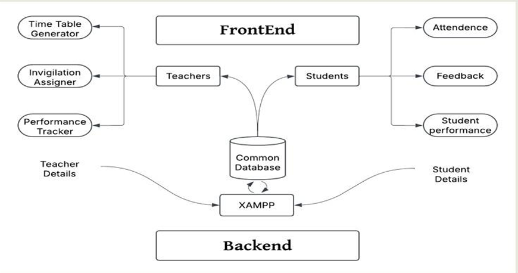
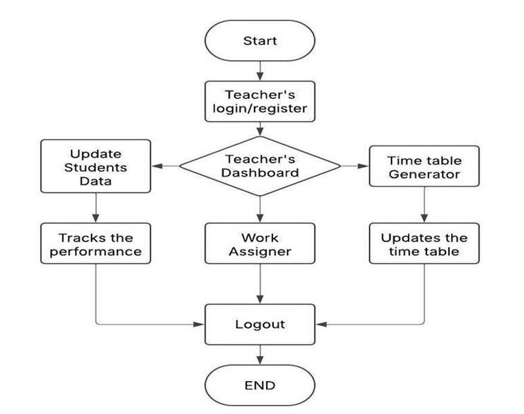
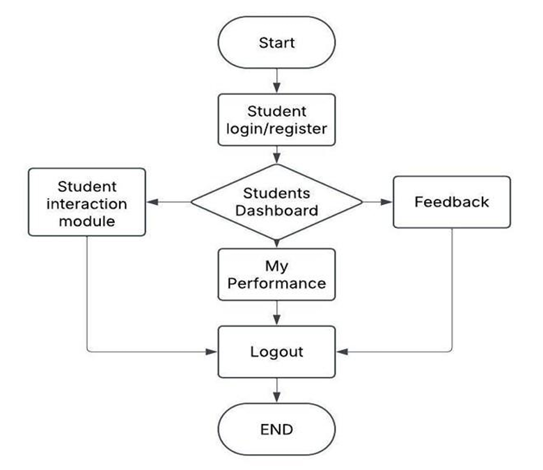
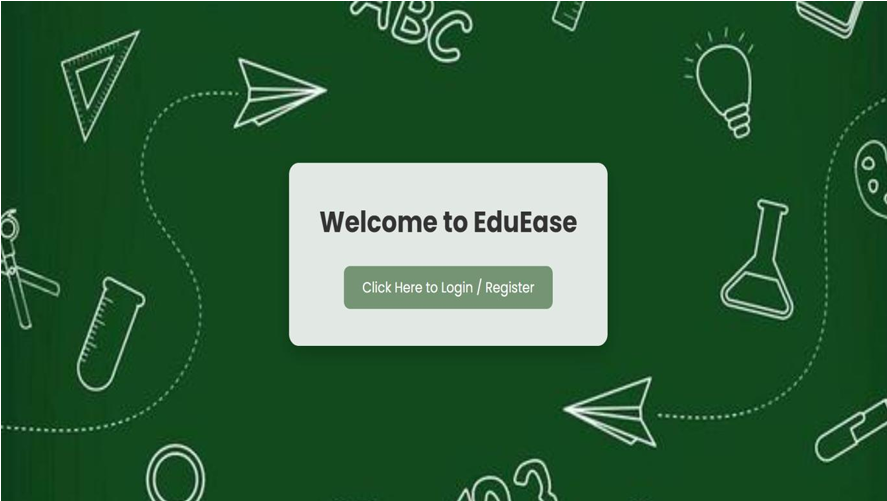
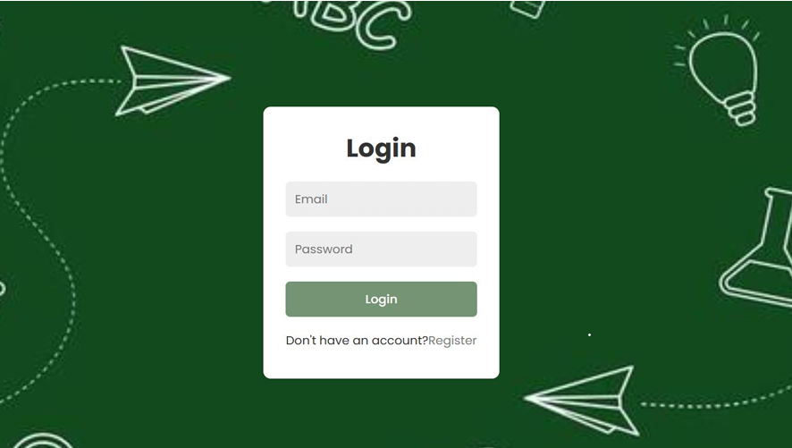
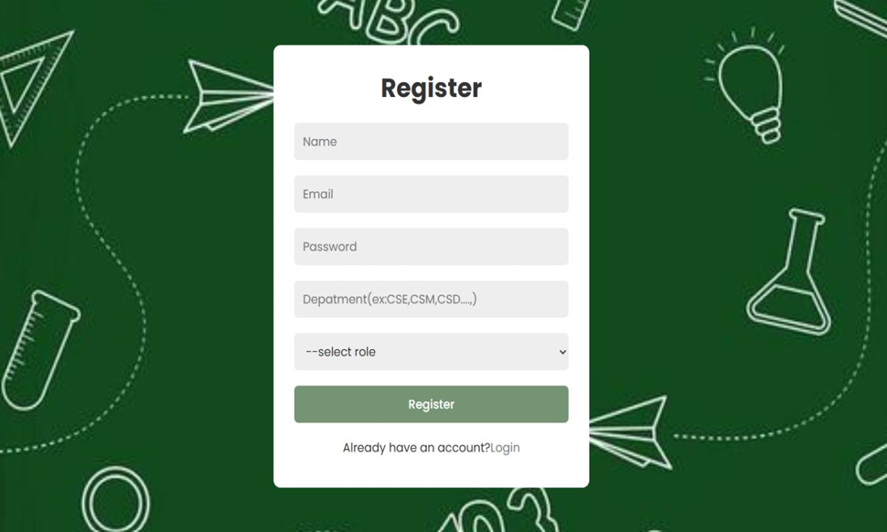
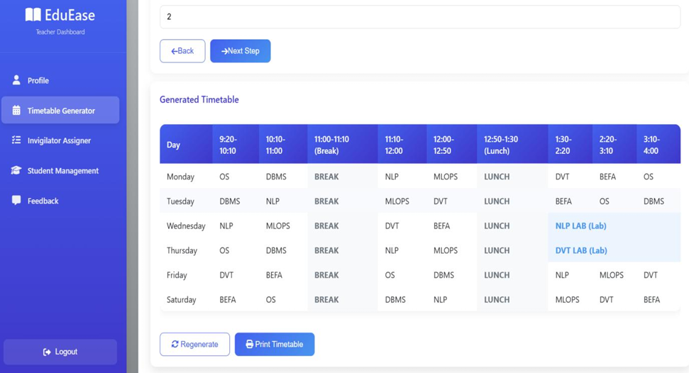
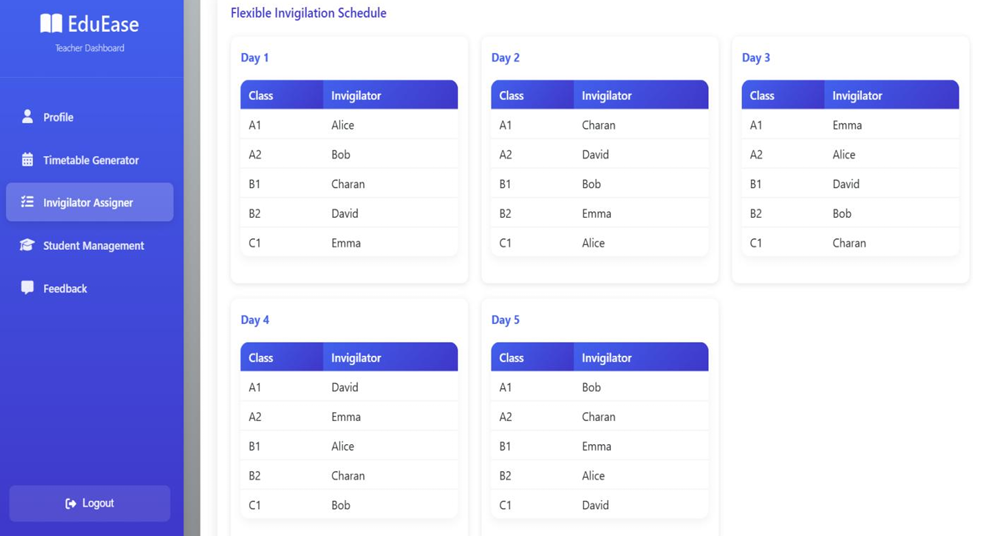
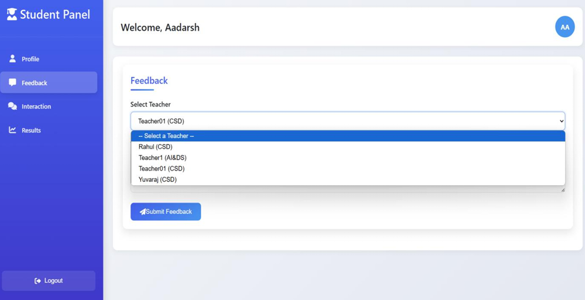

# EduEase: Simplifying Education Management

EduEase is a responsive, web-based academic management platform designed to streamline communication, resource sharing, and core administrative workflows between students, teachers, and administrators. It addresses critical operational inefficiencies in educational institutions—such as manual timetable coordination, student performance tracking, and complex exam invigilation scheduling—by providing an automated, role-based centralized dashboard.

---

## Key Features

*   **Role-Based Access Control (RBAC):** Tailored dashboards and secure session-based navigation for Students, Teachers, and Administrators.
*   **Automated Timetable Generator:** Dynamic conflict-free scheduling engine that maps subjects and labs sequentially based on faculty and room availability.
*   **Assignment Lifecycle Management:** End-to-end framework enabling teachers to distribute tasks and grade submissions, and students to download/upload coursework.
*   **Student Performance Analytics:** Comprehensive dashboard visualizing GPA trends, mid-term scores, and cumulative progress to facilitate data-driven academic insights.
*   **Anonymous Feedback System:** Secure evaluation engine allowing students to submit anonymous reviews for faculty and course optimization.
*   **Invigilator Assigner:** Automated exam duty coordinator leveraging scheduling optimization logic to allocate duties equitably among faculty.

---

## Technology Stack

*   **Frontend:** HTML5, CSS3, JavaScript (ES6+ / AJAX)
*   **Backend:** PHP (Modular, session-controlled)
*   **Database:** MySQL 8.0+ (Relational schema with foreign key constraints)
*   **Environment & Local Hosting:** XAMPP (Apache Server & MySQL Engine)
*   **Production/Deployment:** Vercel (Frontend UI Hosting), AWS EC2 (LAMP Stack / Backend & DB)

---

## Architecture & System Design

EduEase utilizes a **Three-Tier Web Architecture** separating the presentation layer, business logic engine, and underlying data persistence layer to maximize security and horizontal scalability.

### System Architecture


*Figure 1: High-level system interaction model mapping frontend components to backend modules via a common XAMPP infrastructure.*

### Data Flow Diagrams (DFD)
#### Level 0 Context Diagram


*Figure 2: Top-level boundaries highlighting data interaction channels between external entities (Students, Teachers, Admins) and the core platform process.*

#### Level 1 Behavioral Diagram


*Figure 3: Internal architectural breakdown showing data paths moving between authorization blocks, assignment stores, and feedback engines.*

---

## Prototype Screenshots

| Welcome Page | Login Portal |
| :---: | :---: |
|  <br> *Figure 4: Initial application landing screen.* |  <br> *Figure 5: Secure credential authentication.* |

| Registration Form | Generated Timetable |
| :---: | :---: |
|  <br> *Figure 6: Role selection and user provisioning.* |  <br> *Figure 7: Dynamic conflict-free scheduling matrix.* |

| Invigilator Duty Assigner | Student Feedback System |
| :---: | :---: |
|  <br> *Figure 8: Matrix distribution for exam scheduling.* |  <br> *Figure 9: Secure, anonymous course evaluation portal.* |

---

## Getting Started & Installation

### Prerequisites
*   Install XAMPP (with Apache and MySQL modules).
*   A modern web browser (Chrome, Firefox, Edge, or Safari).

### Local Setup Instructions
1.  **Clone the Repository:**
    ```bash
    git clone [https://github.com/your-username/EduEase.git](https://github.com/your-username/EduEase.git)
    ```
2.  **Move to Web Root:** 
    Move the cloned project folder into your XAMPP local server path (typically `C:/xampp/htdocs/EduEase`).
3.  **Database Configuration:**
    *   Open XAMPP Control Panel and start **Apache** and **MySQL**.
    *   Navigate to `http://localhost/phpmyadmin/`.
    *   Create a new database named `eduease`.
    *   Import your structural database backup schema (e.g., `database/eduease.sql`) into the newly created database.
4.  **Configure Connection:**
    Check `config.php` or your database wrapper script to ensure correct connection parameters:
    ```php
    $conn = new mysqli("localhost", "root", "", "eduease");
    ```
5.  **Run the Platform:**
    Open your browser and navigate to: `http://localhost/EduEase/`

---

## Future Enhancements
1.  **Mobile Application Integration:** Construct companion apps for Android/iOS featuring real-time push notifications.
2.  **LMS Synchronization:** Build sync adapters for Moodle, Canvas, and Google Classroom APIs.
3.  **AI Performance Analytics:** Leverage basic machine learning algorithms to map individual study recommendations based on performance trends.
4.  **Automated Attendance Systems:** Integrate biometric hardware or RFID scanners to capture real-time attendance logs.
